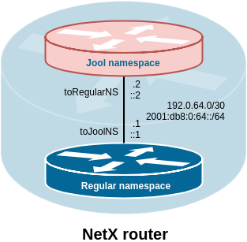

# Stateful NAT64 

> [!TIP]
> Check also the following tutorials:
> * [NA64: Set up basic NAT64 configuration](~/tutorials/nat64/basic-na64.md)

For Stateful NAT64 (RFC 6146) the NetX platform uses [Jool](https://www.jool.mx) developed by [NIC MÉXICO](https://www.nicmexico.mx/) and [Tecnológico de Monterrey](https://tec.mx)

Jool is integrated into the NetX platform using virtual network namespace. After you create a new NAT64 instance, the following virtual topology is created. 



The Jool system is integrated into the `netc` interface. 
All NAT64 related commands are available in `ipv6 nat64` context. 

1. Instance

Instance command creates a new virtual network namespace with a Jool instance. For communication between regular network namespace and Jool's network namespace, virtual interfaces are used, which need to be addressed.

```
netx# ipv6 nat64 instance <NAT64 prefix> <IPv6 P2P subnet> <IPv4 P2P subnet>
netx# no ipv6 nat64
netx# show ipv6 nat64
netx# show ipv6 nat64 session
netx# show ipv6 nat64 stats
```
For example:

```
netx# ipv6 nat64 instance 64:ff9b::/96 2001:db8:0:64::/64 192.0.64.0/30
netx# show ipv6 nat64 
Stateful NAT64 instance is runnig
Is enabled: Yes
NAT64 prefix: 64:ff9b::/96
Pool4: not set. P2P address is used!
BIB Jools entry counts: TCP 0, UDP 0, ICMP 0
```

The first command argument is a NAT64 prefix. It is possible to use Well-Known prefix 64:ff9b::/96 or any other prefix with length /96.
A static route to the Jool's virtual network namespace is automatically created for the selected NAT64 prefix.

The second argument is an IPv6 subnet, that is used for addressing the P2P network between namespaces.

The third argument is an IPv4 subnet, that is used for addressing the P2P network between namespaces.

In this step, NAT64 is already running, and translations are taking place. For translation, the IPv4 address used on the P2P link between the namespaces is used. However, the number of usable ports is limited (61001 to 65535) therefore it is advisable to add an IPv4 pool.

2. IPv4 pool

Adds a pool of IPv4 address for translating IPv6 sources.

```
netx# ipv6 nat64 pool4 <ipv4 pool>
netx# no ipv6 nat64 pool4 <ipv4 pool>
netx# show ipv6 nat64 pool4
```

For example:

```
netx# ipv6 nat64 pool4 192.0.64.128/25
```

A static route to the Jool's virtual network namespace is automatically created for the selected IPv4 pool.

3. BIB

Binding Information Base (BIB) is a table that keeps a binding between a source IPv6 transport address and a source IPv4 transport address. Entries to the table are dynamically inserted based on active connections. It is also possible to add a static record to the table and create a permanent binding. A static record is used if a connection from the IPv4 network needs to be established without prior communication — an analogy of IPv4 port forwarding.

```
netx# ipv6 nat64 bib <ipv4 transport address> <ipv6 transport address>
netx# no ipv6 nat64 bib <ipv4 transport address> <ipv6 transport address>
netx# show ipv6 nat64 bib 
```
For example:

```
netx# ipv6 nat64 bib 192.0.64.129:80 2001:db8:0:42::5.80
netx# ping 64:ff9b::8.8.8.8
netx# show ipv6 nat64 bib
[Static TCP] 192.0.64.129#80 - 2001:db8:0:42::5#80
[Static UDP] 192.0.64.129#80 - 2001:db8:0:42::5#80
[Static ICMP] 192.0.64.129#80 - 2001:db8:0:42::5#80
[Dynamic ICMP] 192.0.64.5#606 - 2001:db8:0:64::1#16363
``` 

4. Jool's instance options

Mantains subset of supported Jool's instance options. 

Supported options are:

* address-dependent-filtering 
* drop-externally-initiated-tcp 
* drop-icmpv6-info     
* f-args               
* handle-rst-during-fin-rcv 
* icmp-timeout         
* logging-bib          
* logging-session      
* manually-enabled     
* maximum-simultaneous-opens 
* mtu-plateaus         
* override-tos         
* source-icmpv6-errors-better 
* tcp-est-timeout      
* tcp-trans-timeout    
* tos                  
* udp-timeout          
* zeroize-traffic-class 

The option meanings are listed in the [official Jool documentation](https://www.jool.mx/en/usr-flags-global.html)

